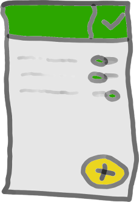
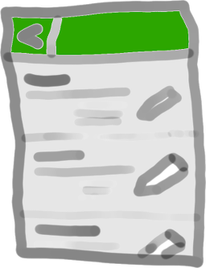
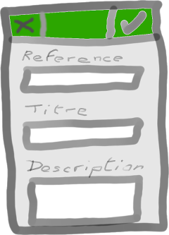

# small-library
Aide au classement par thèmes d'articles rangés physiquement dans une bibliothèque personnelle.
La version de production se trouve ici : https://tolokoban.gihub.io/small-library/index.html

# Spécifications
Si l'application n'a aucun article enregistré, elle démarre sur l'écran __Ajout__, sinon elle démarre sur l'écran __Recherche__.

## Les écrans
L'application se veut extrèmement simple et utilisable préférablement sur téléphone.
Elle se compose de trois écrans principaux :

### Recherche
 

Le bouton dans l'en-tête (en vert sur le schéma) apparaît uniquement quand au moins un thême a été sélectionné.
Il sert à afficher la liste des articles qui font partie du ou des thêmes sélectionnés.

Les thêmes sont affichés dans l'ordre alphabétique dans une liste qui peut défiler si elle est trop grande.

Le gros bouton jaune en bas à droite sert à ajouter un nouvel article à la collection. Il amène à l'écran __Ajout__.

### Résultat
 

Les articles qui correspondent aux thêmes sélectionnés apparaissent par ordre alphabétique de leurs titres.
Une icône en forme de crayon sur la droite de chaque article permet de le modifier en passant par l'écran __Ajout__ en mode _édition_.

Le bouton de l'en-tête permet de retourner à l'écran __Recherche__.

### Ajout
 

Il y a deux boutons dans l'en-tête : tous deux amènent à l'écran précédent. Cependant, celui de gauche annule toute modification, alors que celui de droite les valide.

Les champs à renseigner sont les suivants :
* __Référence__ : La référence pour son clasement dans la bibliothèque, le classeur, ...
* __Titre__ : Le titre de l'article.
* __Description__ : (_facultatif_).

De plus, il faut sélectionner les thêmes auxquel cet article est associé.
Pour cela, une liste des thêmes existants apparaît comme dans l'écran __Recherche__.
Et une nouvelle zone de saisie permet d'ajouter des thêmes en les séparant par une virgule.

#### Mode édition
Quand cet écran est utilisé pour modifier un article, les champs sont pré-remplis avec les données de l'article sélectionné.
De plus, un grand bouton apparaît avant la référence pour permettre de supprimer définitivement cet article de la collection.

